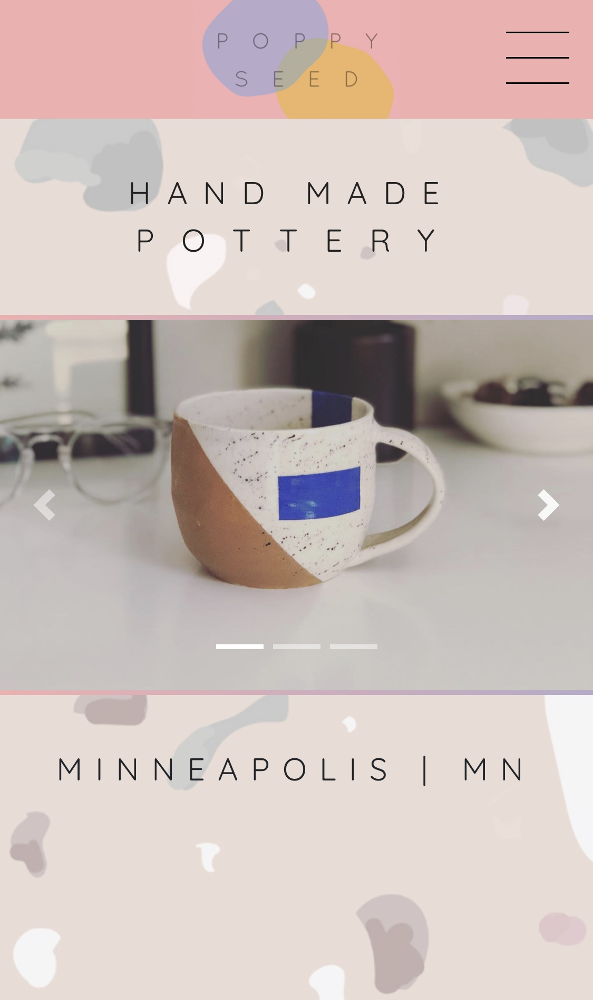
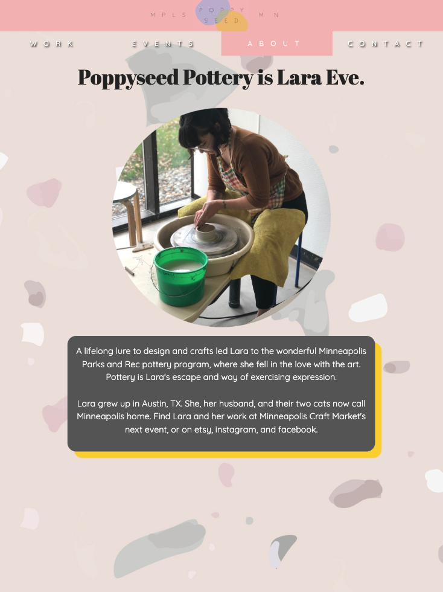
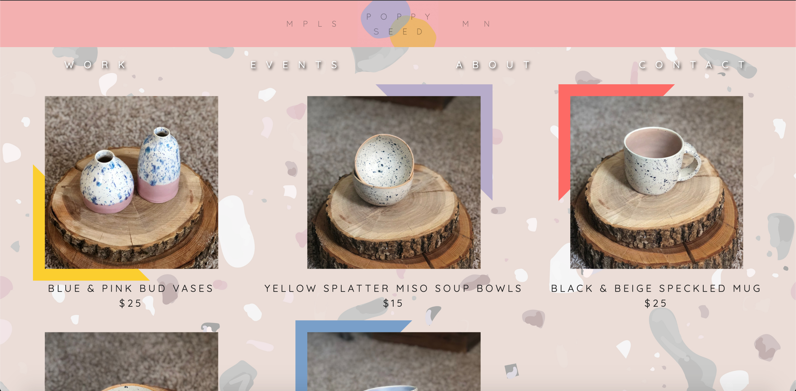

# Poppyseed Pottery
Poppyseed Pottery is a Minneapolis, Minnesota based pottery business. This project was created to showcase, and build awareness of her work, as well as give updates on upcoming events and provide contact information for prospective customers/clients. 

This project was built with mobile-first, responsive web design principles - so view it on your phone, laptop, or tablet.

## Getting Started

To view the live site, visit: 
https://poppyseedpottery.co

OR 

Steps to get the development environment running are as follows: 

1) Download the zip file of this repo
2) Open project in preferred code editor
3) Open terminal, or your preferred command line interface
    - To install dependencies, type command: 
        npm install
    - To launch project in browser, type command: 
        npm run client 

## Built With
React.js, Bootstrap, HTML/CSS (CSS Grid for responsive design), Node.js

## Screenshots

### Mobile

### Tablet

### Desktop

## Scope Document (Need to request access to view)

Mockups designed in Adobe XD

https://docs.google.com/document/d/1iyPRpwJf50qZxWwDV6yJjaCZjNY_PeNontCV3X-ABs8/edit

## Completed Features 

1) Home page with carousel, giving viewer brief demo of work 
2) Shop feature connecting viewers to Poppyseed Pottery etsy page 
3) Events page to update viewers on upcoming events 
4) About page to give viewer a short history of the business 
5) Contact page to provide contact details, including links to social media profiles 
6) Responsive design feature, components render according to rules set to viewport sizes

## Future Features 

1) Payment API to provide customers with the option to purchase work from site

